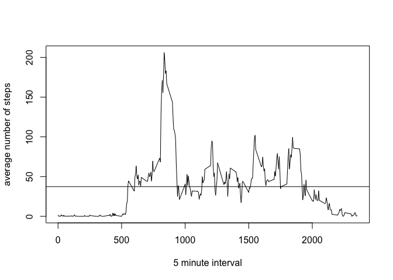
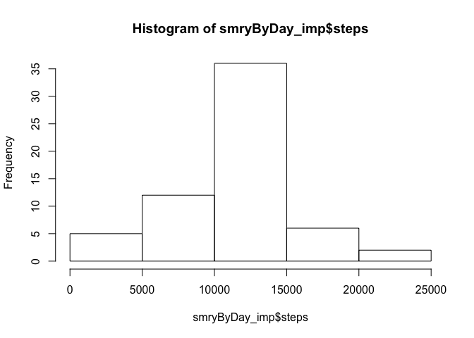

# Reproducible Research: Peer Assessment 1


## Loading and preprocessing the data
### 1. Load the data

```r
fileUrl<-"https://d396qusza40orc.cloudfront.net/repdata%2Fdata%2Factivity.zip"
download.file(fileUrl,dest="repdata-data-activity.zip",method="curl")
unzip("repdata-data-activity.zip","activity.csv")
```

### 2. Process/transform the data (if necessary) into a format suitable for your analysis

```r
activity<-read.csv("activity.csv")
str(activity)
```

```
## 'data.frame':	17568 obs. of  3 variables:
##  $ steps   : int  NA NA NA NA NA NA NA NA NA NA ...
##  $ date    : Factor w/ 61 levels "2012-10-01","2012-10-02",..: 1 1 1 1 1 1 1 1 1 1 ...
##  $ interval: int  0 5 10 15 20 25 30 35 40 45 ...
```

```r
summary(activity)
```

```
##      steps                date          interval     
##  Min.   :  0.00   2012-10-01:  288   Min.   :   0.0  
##  1st Qu.:  0.00   2012-10-02:  288   1st Qu.: 588.8  
##  Median :  0.00   2012-10-03:  288   Median :1177.5  
##  Mean   : 37.38   2012-10-04:  288   Mean   :1177.5  
##  3rd Qu.: 12.00   2012-10-05:  288   3rd Qu.:1766.2  
##  Max.   :806.00   2012-10-06:  288   Max.   :2355.0  
##  NA's   :2304     (Other)   :15840
```

```r
activity$date<-as.Date(activity$date)
str(activity)
```

```
## 'data.frame':	17568 obs. of  3 variables:
##  $ steps   : int  NA NA NA NA NA NA NA NA NA NA ...
##  $ date    : Date, format: "2012-10-01" "2012-10-01" ...
##  $ interval: int  0 5 10 15 20 25 30 35 40 45 ...
```


## What is mean total number of steps taken per day?
### 1. Make a histogram of the total number of steps taken each day

  1-1. Calculate the total number of steps taken per day

```r
library(reshape)
meltByDay<-melt(activity,id="date", na.rm = TRUE)
smryByDay<-cast(meltByDay,date~variable,sum,subset=variable=="steps")
head(smryByDay);tail(smryByDay)
```

```
##         date steps
## 1 2012-10-02   126
## 2 2012-10-03 11352
## 3 2012-10-04 12116
## 4 2012-10-05 13294
## 5 2012-10-06 15420
## 6 2012-10-07 11015
```

```
##          date steps
## 48 2012-11-24 14478
## 49 2012-11-25 11834
## 50 2012-11-26 11162
## 51 2012-11-27 13646
## 52 2012-11-28 10183
## 53 2012-11-29  7047
```

```r
summary(smryByDay)
```

```
##       date                steps      
##  Min.   :2012-10-02   Min.   :   41  
##  1st Qu.:2012-10-16   1st Qu.: 8841  
##  Median :2012-10-29   Median :10765  
##  Mean   :2012-10-30   Mean   :10766  
##  3rd Qu.:2012-11-16   3rd Qu.:13294  
##  Max.   :2012-11-29   Max.   :21194
```

  1-2. Make a histogram of the total number of steps taken each day

```r
hist(smryByDay$steps)
```

 

### 2. Calculate and report the mean and median total number of steps taken per day

Here are the code and the results.

```r
mean(smryByDay$steps)
```

```
## [1] 10766.19
```

```r
median(smryByDay$steps)
```

```
## [1] 10765
```

As you in the above, the mean is 1.0766189\times 10^{4} and the median is 10765.

## What is the average daily activity pattern?
### 1. Make a time series plot (i.e. type = "l") of the 5-minute interval (x-axis) and the average number of steps taken, averaged across all days (y-axis)

```r
meltByInt<-melt(activity,id="interval", na.rm = TRUE)
smryByInt<-cast(meltByInt,interval~variable,mean,subset=variable=="steps")
head(smryByInt);tail(smryByInt)
```

```
##   interval     steps
## 1        0 1.7169811
## 2        5 0.3396226
## 3       10 0.1320755
## 4       15 0.1509434
## 5       20 0.0754717
## 6       25 2.0943396
```

```
##     interval     steps
## 283     2330 2.6037736
## 284     2335 4.6981132
## 285     2340 3.3018868
## 286     2345 0.6415094
## 287     2350 0.2264151
## 288     2355 1.0754717
```

```r
summary(smryByInt)
```

```
##     interval          steps        
##  Min.   :   0.0   Min.   :  0.000  
##  1st Qu.: 588.8   1st Qu.:  2.486  
##  Median :1177.5   Median : 34.113  
##  Mean   :1177.5   Mean   : 37.383  
##  3rd Qu.:1766.2   3rd Qu.: 52.835  
##  Max.   :2355.0   Max.   :206.170
```

```r
with(data=smryByInt, plot(interval, steps, type="l",xlab="5 minute interval", ylab="average number of steps"))
with(data=smryByInt, abline(h=mean(steps)))
```

 

### 2. Which 5-minute interval, on average across all the days in the dataset, contains the maximum number of steps?

```r
smryByInt[smryByInt$steps==max(smryByInt$steps),]
```

```
##     interval    steps
## 104      835 206.1698
```
As you see in the above, maximum number of steps is 206.1698113 at the interval 835.

## Imputing missing values
Note that there are a number of days/intervals where there are missing values (coded as NA). The presence of missing days may introduce bias into some calculations or summaries of the data.

### 1. Calculate and report the total number of missing values in the dataset (i.e. the total number of rows with NAs)

```r
summary(activity)
```

```
##      steps             date               interval     
##  Min.   :  0.00   Min.   :2012-10-01   Min.   :   0.0  
##  1st Qu.:  0.00   1st Qu.:2012-10-16   1st Qu.: 588.8  
##  Median :  0.00   Median :2012-10-31   Median :1177.5  
##  Mean   : 37.38   Mean   :2012-10-31   Mean   :1177.5  
##  3rd Qu.: 12.00   3rd Qu.:2012-11-15   3rd Qu.:1766.2  
##  Max.   :806.00   Max.   :2012-11-30   Max.   :2355.0  
##  NA's   :2304
```

```r
sum(is.na(activity$steps))
```

```
## [1] 2304
```
As you see in the above, there are 2304 missing values only in column "steps".

### 2. Devise a strategy for filling in all of the missing values in the dataset. The strategy does not need to be sophisticated. For example, you could use the mean/median for that day, or the mean for that 5-minute interval, etc.

Ans) I will use the mean for that 5-minute interval for the missing values.


### 3. Create a new dataset that is equal to the original dataset but with the missing data filled in.

```r
act_imp<-activity
ind<-which(is.na(act_imp$steps))
for (i in ind){
    act_imp$steps[i]<-smryByInt$steps[act_imp$interval[i]==smryByInt$interval]
}

summary(act_imp)
```

```
##      steps             date               interval     
##  Min.   :  0.00   Min.   :2012-10-01   Min.   :   0.0  
##  1st Qu.:  0.00   1st Qu.:2012-10-16   1st Qu.: 588.8  
##  Median :  0.00   Median :2012-10-31   Median :1177.5  
##  Mean   : 37.38   Mean   :2012-10-31   Mean   :1177.5  
##  3rd Qu.: 27.00   3rd Qu.:2012-11-15   3rd Qu.:1766.2  
##  Max.   :806.00   Max.   :2012-11-30   Max.   :2355.0
```
As you see in the above result of summary(act_imp), there is no missing value any more.

### 4. Make a histogram of the total number of steps taken each day and Calculate and report the mean and median total number of steps taken per day. Do these values differ from the estimates from the first part of the assignment? What is the impact of imputing missing data on the estimates of the total daily number of steps?

4-1. Caculate the total number of steps taken each day

```r
meltByDay_imp<-melt(act_imp,id="date", na.rm = TRUE)
smryByDay_imp<-cast(meltByDay_imp,date~variable,sum,subset=variable=="steps")
summary(smryByDay_imp)
```

```
##       date                steps      
##  Min.   :2012-10-01   Min.   :   41  
##  1st Qu.:2012-10-16   1st Qu.: 9819  
##  Median :2012-10-31   Median :10766  
##  Mean   :2012-10-31   Mean   :10766  
##  3rd Qu.:2012-11-15   3rd Qu.:12811  
##  Max.   :2012-11-30   Max.   :21194
```

4-2. Make a histogram

```r
hist(smryByDay_imp$steps)
```

 

4-3. Calculate and report the mean and median

```r
mean(smryByDay_imp$steps)
```

```
## [1] 10766.19
```

```r
median(smryByDay_imp$steps)
```

```
## [1] 10766.19
```
As you see in the above, the mean is 1.0766189\times 10^{4} and the median is 1.0766189\times 10^{4}.

4-4. Do these values differ from the estimates from the first part of the assignment?

(i) summary

```r
summary(smryByDay_imp)
```

```
##       date                steps      
##  Min.   :2012-10-01   Min.   :   41  
##  1st Qu.:2012-10-16   1st Qu.: 9819  
##  Median :2012-10-31   Median :10766  
##  Mean   :2012-10-31   Mean   :10766  
##  3rd Qu.:2012-11-15   3rd Qu.:12811  
##  Max.   :2012-11-30   Max.   :21194
```

```r
summary(smryByDay)
```

```
##       date                steps      
##  Min.   :2012-10-02   Min.   :   41  
##  1st Qu.:2012-10-16   1st Qu.: 8841  
##  Median :2012-10-29   Median :10765  
##  Mean   :2012-10-30   Mean   :10766  
##  3rd Qu.:2012-11-16   3rd Qu.:13294  
##  Max.   :2012-11-29   Max.   :21194
```
As you see in the above summaries, steps in imputed data are increased.

But the mean and median are changed just a little. I guess the reason is that I used the mean of the interval.

(ii) comparison between histgram

```r
par(mfrow=c(1,2))
hist(smryByDay_imp$steps,ylim=c(0,40))
hist(smryByDay$steps,ylim=c(0,40))
```

 

```r
par(mfrow=c(1,1))
```
As like the comparison betwwen summaries, two histograms also show that the steps of the imputed data are increased.

(iii) mean and median

```r
mean(smryByDay_imp$steps) # 10766.19
```

```
## [1] 10766.19
```

```r
mean(smryByDay$steps) # 10766.19
```

```
## [1] 10766.19
```

```r
mean(smryByDay_imp$steps) - mean(smryByDay$steps) # 10766.19
```

```
## [1] 0
```

```r
mean(smryByDay_imp$steps) == mean(smryByDay$steps) # 10766.19
```

```
## [1] TRUE
```
Coincidentally, the means are the same. I guessed it's slightly changed.


```r
median(smryByDay_imp$steps) # 10766.19 != 10765
```

```
## [1] 10766.19
```

```r
median(smryByDay$steps) # 10766.19 != 10765
```

```
## [1] 10765
```

```r
median(smryByDay_imp$steps) - median(smryByDay$steps)
```

```
## [1] 1.188679
```
The medians is changed slightly as I guessed.

4-5. What is the impact of imputing missing data on the estimates of the total daily number of steps?

As in the above 4-4 (ii), the overall steps are increased. I guess it's because imputing procedure I devised replaces missing data with positive steps.


## Are there differences in activity patterns between weekdays and weekends?
### 1. Create a new factor variable in the dataset with two levels -- "weekday" and "weekend" indicating whether a given date is a weekday or weekend day.

```r
Sys.setlocale("LC_TIME", "en_US.UTF-8")
```

```
## [1] "en_US.UTF-8"
```

```r
act_wDE<-act_imp
act_wDE$wDayEnd<-"weekday"
str(act_wDE)
```

```
## 'data.frame':	17568 obs. of  4 variables:
##  $ steps   : num  1.717 0.3396 0.1321 0.1509 0.0755 ...
##  $ date    : Date, format: "2012-10-01" "2012-10-01" ...
##  $ interval: int  0 5 10 15 20 25 30 35 40 45 ...
##  $ wDayEnd : chr  "weekday" "weekday" "weekday" "weekday" ...
```

```r
summary(act_wDE)
```

```
##      steps             date               interval        wDayEnd         
##  Min.   :  0.00   Min.   :2012-10-01   Min.   :   0.0   Length:17568      
##  1st Qu.:  0.00   1st Qu.:2012-10-16   1st Qu.: 588.8   Class :character  
##  Median :  0.00   Median :2012-10-31   Median :1177.5   Mode  :character  
##  Mean   : 37.38   Mean   :2012-10-31   Mean   :1177.5                     
##  3rd Qu.: 27.00   3rd Qu.:2012-11-15   3rd Qu.:1766.2                     
##  Max.   :806.00   Max.   :2012-11-30   Max.   :2355.0
```

```r
ind<-which(weekdays(act_wDE$date) %in% c("Saturday","Sunday"))
act_wDE$wDayEnd[ind]<-"weekend"
act_wDE[c(1,1441),]
```

```
##         steps       date interval wDayEnd
## 1    1.716981 2012-10-01        0 weekday
## 1441 0.000000 2012-10-06        0 weekend
```

```r
act_wDE$wDayEnd<-factor(act_wDE$wDayEnd,levels=c("weekday","weekend"))
str(act_wDE)
```

```
## 'data.frame':	17568 obs. of  4 variables:
##  $ steps   : num  1.717 0.3396 0.1321 0.1509 0.0755 ...
##  $ date    : Date, format: "2012-10-01" "2012-10-01" ...
##  $ interval: int  0 5 10 15 20 25 30 35 40 45 ...
##  $ wDayEnd : Factor w/ 2 levels "weekday","weekend": 1 1 1 1 1 1 1 1 1 1 ...
```

```r
summary(act_wDE)
```

```
##      steps             date               interval         wDayEnd     
##  Min.   :  0.00   Min.   :2012-10-01   Min.   :   0.0   weekday:12960  
##  1st Qu.:  0.00   1st Qu.:2012-10-16   1st Qu.: 588.8   weekend: 4608  
##  Median :  0.00   Median :2012-10-31   Median :1177.5                  
##  Mean   : 37.38   Mean   :2012-10-31   Mean   :1177.5                  
##  3rd Qu.: 27.00   3rd Qu.:2012-11-15   3rd Qu.:1766.2                  
##  Max.   :806.00   Max.   :2012-11-30   Max.   :2355.0
```

### 2. Make a panel plot containing a time series plot (i.e. type = "l") of the 5-minute interval (x-axis) and the average number of steps taken, averaged across all weekday days or weekend days (y-axis). 

2-1. Caculate the total number of steps taken each day

```r
library(sqldf)
```

```
## Warning: package 'sqldf' was built under R version 3.1.2
```

```
## Loading required package: gsubfn
```

```
## Warning: package 'gsubfn' was built under R version 3.1.2
```

```
## Loading required package: proto
## Loading required package: RSQLite
```

```
## Warning: package 'RSQLite' was built under R version 3.1.2
```

```
## Loading required package: DBI
```

```
## Warning: package 'DBI' was built under R version 3.1.2
```

```r
head(act_wDE)
```

```
##       steps       date interval wDayEnd
## 1 1.7169811 2012-10-01        0 weekday
## 2 0.3396226 2012-10-01        5 weekday
## 3 0.1320755 2012-10-01       10 weekday
## 4 0.1509434 2012-10-01       15 weekday
## 5 0.0754717 2012-10-01       20 weekday
## 6 2.0943396 2012-10-01       25 weekday
```

```r
smryBywDayEnd<-sqldf("select interval, wDayEnd, avg(steps) steps from act_wDE group by interval, wDayEnd")
```

```
## Loading required package: tcltk
```

```r
head(smryBywDayEnd,4);tail(smryBywDayEnd,4)
```

```
##   interval wDayEnd      steps
## 1        0 weekday 2.25115304
## 2        0 weekend 0.21462264
## 3        5 weekday 0.44528302
## 4        5 weekend 0.04245283
```

```
##     interval wDayEnd      steps
## 573     2350 weekday 0.29685535
## 574     2350 weekend 0.02830189
## 575     2355 weekday 1.41006289
## 576     2355 weekend 0.13443396
```

```r
summary(smryBywDayEnd)
```

```
##     interval         wDayEnd        steps        
##  Min.   :   0.0   weekday:288   Min.   :  0.000  
##  1st Qu.: 588.8   weekend:288   1st Qu.:  2.047  
##  Median :1177.5                 Median : 28.133  
##  Mean   :1177.5                 Mean   : 38.988  
##  3rd Qu.:1766.2                 3rd Qu.: 61.263  
##  Max.   :2355.0                 Max.   :230.378
```

2-2. Make a panel plot

```r
library(lattice)
```

```
## Warning: package 'lattice' was built under R version 3.1.2
```

```r
xyplot(steps ~ interval | wDayEnd, data = smryBywDayEnd, xlab="Interval", ylab="Number of steps", type="l", layout = c(1, 2))
```

 

As a result, in weekdays the steps tend to be centered in the prior portion of intervals and in weekends the steps are spread evenly through out intervals between 800 and 2000.

I guess this tendency is because in weekdays people commute and in weekends people enjoy their free time whole day.
